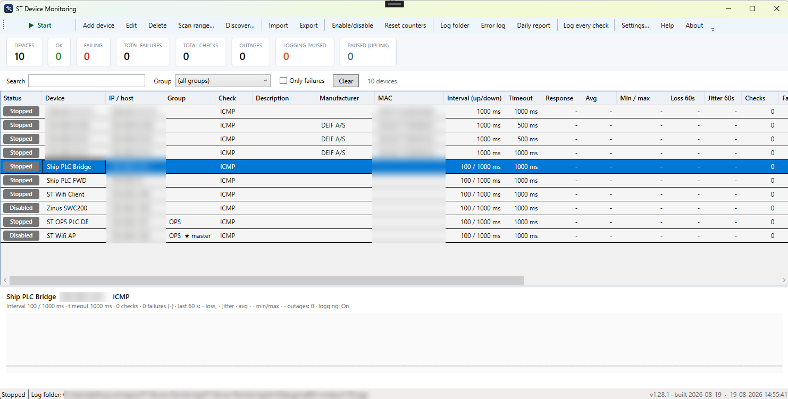
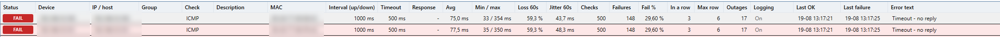
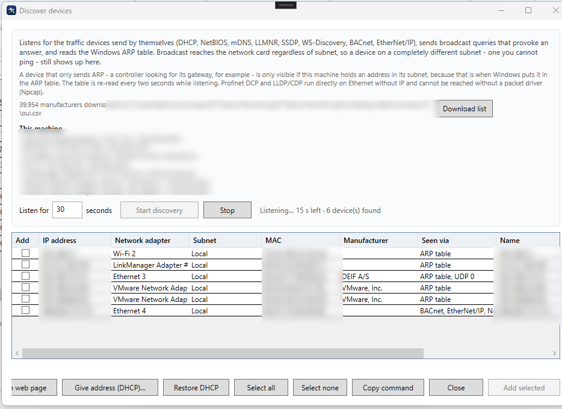

<h1 align="center">
  <br>
  ST Device Monitoring
</h1>

<p align="center">
  Windows application (WPF, .NET 8) that checks devices with <b>ICMP, TCP or SNMP</b>,
  shows their status live, alerts on failures and logs everything to CSV.<br>
  It can also run as a Windows service without a logged-in user.
</p>

<p align="center">
  <a href="https://github.com/JesperSOGT/ST-Device-Monitoring/releases/latest">
    
  </a>
  
  
</p>

---

### The main window

Every device on one line: colour-coded status, check type, manufacturer behind the MAC address,
intervals, response time, packet loss and jitter over the last 60 seconds, failure counters and
outages. The panel at the bottom shows the history graph for the selected device.
(Addresses are blurred in the screenshot.)



Detail from a running system - amber "Unstable" and red "FAIL" show at a glance which devices are
losing packets:



### Finding devices without knowing their IP

Discovery listens for the traffic devices send by themselves, sends broadcast queries and reads the
ARP table - so a device on a completely different subnet, one that cannot be pinged, still shows up.
From here the machine can be given an address in the device's subnet, the device's web page can be
opened, or a small built-in DHCP server can hand it an address:



## Download

Grab the latest build from the [releases page](https://github.com/JesperSOGT/ST-Device-Monitoring/releases/latest):

| File | Use it when |
|---|---|
| `ST-Device-Monitoring-<version>.exe` | Any Windows machine - single file, nothing to install, no .NET needed (~72 MB) |
| `...-win-x64.zip` | The machine already has the [.NET 8 Desktop Runtime](https://dotnet.microsoft.com/download/dotnet/8.0) (~1 MB) |

The executable is not code signed, so Windows SmartScreen asks once: *More info -> Run anyway*.
Put it in a folder it may write to (not `C:\Program Files`) - `devices.json`, `Logs\` and `oui.csv`
are created next to it.

## Licence

Free for **private, non-commercial use**. Commercial use - inside a company, at a customer site or
as part of a delivery - redistribution and derived works require written permission. The source is
published so it can be read and reviewed, not reused. No warranty: monitoring software must never be
the only protection of a process. See [LICENSE](LICENSE) for the full text.

## Build it yourself

```
git clone https://github.com/JesperSOGT/ST-Device-Monitoring.git
cd "ST-Device-Monitoring"
publish.cmd
```

`publish.cmd` writes both variants to `publish\`. Pushing a tag (`git tag v1.29.0 && git push origin v1.29.0`)
builds them on GitHub and publishes a release automatically.

## Features

- **Devices** with name, IP address/hostname, group, check type, interval, down interval, timeout,
  "consecutive failures before alarm" and "stop logging after N failures". Stored in `devices.json`
  next to the executable.
- **Three check types per device**: ICMP ping, a **TCP connect to a port** (502 Modbus, 102 S7,
  80 HTTP …) for devices that block ICMP, or an **SNMP v2c GET** (default port 161).
- **SNMP description**: in SNMP mode the device description is read from `sysDescr` the first time
  a check succeeds and stored on the device (`sysName` fills the name if it is empty). The edit
  dialog has a *Read from device (SNMP)* button, and the range scan shows and imports the
  description for every device that answers. The SNMP client is built into the application
  (BER over UDP) - no external package.
- **Multithreading**: every device runs its own asynchronous check loop on the thread pool. Devices
  do not affect each other's timing, and the UI thread never checks anything.
- **Adding a device never interrupts the others**: a new device gets its own loop and starts
  immediately if monitoring is running. Editing restarts only that one device.
- **Adaptive interval**: while a device is down it is checked at `DownIntervalMs` instead of the
  normal interval, so a 100 ms device does not flood the network while offline.
- **Live figures**: status colour per row, plus counters (checks, failures, fail %, failures in a
  row, max in a row, outages, min/avg/max response) **and rolling loss % and jitter over the last
  60 seconds**, which react immediately instead of being diluted by a day of totals.
- **History graph** of the last 120 checks for the selected device.
- **Group master (uplink dependency)**: one device per group can be marked as the group's master -
  typically the switch or router the group sits behind. The other devices in that group are only
  checked while the master answers. When the master goes down they are **paused** (status
  *Paused*, one `PAUSED` line in the log) instead of all failing at once, and they resume with a
  `RESUMED` line as soon as the master answers again. No alarms, no failure counts and no log
  noise for devices that are only unreachable because the uplink is down.
- **Filtering**: search box (name/host/group), group drop-down and an "only failures" view.
- **Alerts**: tray icon with balloon notifications, sound on failure, SMTP e-mail and webhook
  (JSON POST for Teams/Slack/ticket systems), with per-device throttling.
- **Daily report**: `summary_yyyyMMdd.csv` with uptime %, outages, longest outage and total
  downtime per device - written automatically at midnight and on demand.
- **Import/export** of the device list as CSV, and an **IP range scan** that finds live devices
  and adds them in one go.
- **IPv4 validation**: anything typed as digits and dots is checked strictly (four octets, 0-255,
  no leading zeros) while you type - `192.168.1.300` or `192.168.1` is rejected instead of being
  treated as a hostname. Hostnames are checked for legal characters and label lengths. The same
  check runs on CSV import and on the scan range.
- **Duplicate check** on host (and port) plus a warning when the timeout is longer than the interval.
- **Run as a Windows service** or as a normal application - selectable in Settings.
- **About dialog** with logo, version and copyright. Version and build date live in `AppInfo.cs`.

## Run mode: application or Windows service

Settings → **Run mode**:

- **Normal application** - monitoring runs while the program is open. It can minimise to the system
  tray, close to the tray and start with Windows for the current user.
- **Windows service** - press *Install service*. Windows starts `ST Device Monitoring.exe --service`
  at boot, before anyone logs in, and restarts it automatically if it stops. The service has no user
  interface: it writes the CSV logs, the daily summary and sends e-mail/webhook alerts. Install,
  start, stop and remove all require administrator rights, so a UAC prompt appears.

Notes:

- The service reads `devices.json` when it starts - restart the service after changing the device list.
- Do not run the service and the window monitoring at the same time unless you want both writing to
  the same log folder; the application warns you at startup when the service is running.
- The SMTP password is encrypted with the Windows DPAPI for the user who entered it. A service
  running as LocalSystem cannot decrypt it - use a relay without authentication, or set the service
  to log on as the same user.
- The service writes start/stop lines to `service.log` next to the executable.

## Log files, size limit and rotation

Choose in Settings -> Logging what happens when a log file passes its size limit:

- **New file + zip** - the file is renamed with a timestamp (`ping_20260819_143012.csv`), compressed
  to `.zip` in the background and the `.csv` is deleted. Logging continues in a fresh file without
  losing an entry, and the whole history is kept.
- **Ring buffer** - the file keeps its name and the oldest lines are removed when the limit is hit,
  so it always holds the newest entries and never grows past the limit. A `TRIMMED` line marks
  where older entries were cut away.
- **No limit** - one file per day, however big it gets.

`Log every check` decides whether successful checks are logged at all. With it off only failures are
logged - except the **first successful check of each device**, which is always written so the log
shows when the device was first seen online.

## MAC address

The first time a device answers, its MAC address is looked up in the Windows ARP table and stored in
`devices.json` (and shown in the MAC column). Only devices on the same subnet have an ARP entry - a
device behind a router stays empty.

## Help in the application

The **Help** button (or F1) opens a help window with one page per function: check types, intervals,
counters, log suppression, group master, notifications, log files, reports, import/export and run mode.

## Failure log suppression

A device that is down would otherwise fill the log with one identical failure line per interval
(36,000 lines/hour at 100 ms). Each device therefore has **`MaxLoggedFailures`**:

1. The first *N* consecutive failures are logged normally.
2. On failure number *N* an extra note is written:
   `N consecutive failures - further failures are not logged, checking continues until the device recovers`.
3. After that the device **is still checked** and the counters/UI keep updating, but nothing more is
   written to the log for that outage. The "Logging" column shows `Paused (n)`.
4. When the device answers again, a `RECOVERED` line is written:
   `Back online after 42.5 s, 380 failed check(s), 375 not logged`.

`MaxLoggedFailures = 0` disables suppression.

## Files written

All files live in the `Logs` folder (configurable, may be an absolute path):

| File | Contents |
|---|---|
| `ping_yyyyMMdd.csv` | Every check including response time (can be switched off) |
| `errors_yyyyMMdd.csv` | Failures, suppression notices and recoveries only |
| `summary_yyyyMMdd.csv` | One row per device: uptime %, outages, longest outage, total downtime |

Separator `;` with a `sep=;` first line, so the files open correctly in Excel. Files older than
`LogRetentionDays` (default 30) are deleted at startup.

Log columns: `Timestamp;Device;Host;Result;ResponseMs;Status;ConsecutiveFails;Info`, where `Result`
is `OK`, `FAIL` or `RECOVERED`.

## Architecture

| File | Responsibility |
|---|---|
| `Program.cs` | Entry point - normal application or `--service` |
| `Models/DeviceConfig.cs` | Device settings, `AppConfig`, alert and UI settings |
| `Core/ConfigStore.cs` | Read/write devices.json |
| `Core/DeviceMonitor.cs` | Check loop per device (ICMP/TCP), counters, history, log suppression, adaptive interval, alerts |
| `Core/MonitorService.cs` | Start/stop/add/remove, alert routing, daily summary |
| `Core/CsvLogger.cs` | Thread-safe queue (Channel) + one writer thread, buffered, flushed every second |
| `Core/RollingWindow.cs` | Loss/jitter over the last 60 seconds (one bucket per second) |
| `Core/DailySummary.cs` | Per-day accumulation and `summary_*.csv` |
| `Core/AlertDispatcher.cs` | E-mail and webhook, with throttling |
| `Core/HostScanner.cs` | Parallel IP range scan |
| `Core/DeviceImportExport.cs` | CSV import/export of the device list |
| `Core/WindowsServiceHost.cs` | Runs headless as a Windows service (raw service API, no NuGet) |
| `Core/WindowsServiceInstaller.cs` | Install/remove/start/stop via `sc.exe`, elevated |
| `Core/DpapiProtector.cs` | Encrypts the SMTP password (crypt32) |
| `Controls/TrayNotifier.cs` | Tray icon, balloon notifications, sound |
| `Controls/StartupRegistration.cs` | "Start with Windows" (HKCU Run) |
| `Controls/HistoryStrip.cs` | History graph drawn directly in `OnRender` |
| `ViewModels/` | Snapshot of the counters for the UI + colour converters |
| `MainWindow.xaml(.cs)` | Table, tiles, filters, toolbar, detail panel, tray |
| `Views/` | Add/edit device, settings, range scan, about |

### Threading model

- The check threads **never** touch WPF objects. They update `Interlocked` counters and push log
  records into a channel; alerts are marshalled to the UI thread by the window.
- The UI reads a **snapshot** (`DeviceMonitor.GetStats()`) from a `DispatcherTimer` (default every
  250 ms) and only updates bindings when something changed.
- The log channel is bounded at 200,000 records. If the disk cannot keep up, records are dropped
  (the count is shown in the status bar) instead of slowing down the check timing.
- E-mail and webhook calls run on the thread pool - a dead mail server can never stall monitoring.

### Performance

100 ms interval ≈ 36,000 lines per hour per device in `ping_*.csv`. With many devices at 100 ms,
turn off "Log every check" so only failures are logged - or put the log folder on an SSD.
The `Ping` class uses the Windows ICMP API and needs no administrator rights, but firewalls and
network equipment may block ICMP - use the TCP check for those devices.

## Configuration (devices.json)

```json
{
  "Devices": [
    {
      "Name": "PLC Quay 3",
      "Host": "192.168.1.50",
      "Group": "Quay 3",
      "Mode": "TcpPort",
      "Port": 502,
      "IntervalMs": 100,
      "DownIntervalMs": 1000,
      "TimeoutMs": 500,
      "FailThreshold": 3,
      "MaxLoggedFailures": 10,
      "Enabled": true
    }
  ],
  "LogDirectory": "Logs",
  "LogAllPings": true,
  "UiRefreshMs": 250,
  "CsvSeparator": ";",
  "LogRetentionDays": 30,
  "AutoStart": false,
  "WriteDailySummary": true,
  "Alerts": { "BalloonEnabled": true, "SoundEnabled": true, "EmailEnabled": false, "WebhookEnabled": false },
  "Ui": { "ShowTrayIcon": true, "MinimizeToTray": true, "CloseToTray": false, "StartMinimized": false }
}
```

`Mode` is `Icmp` or `TcpPort`. `LogDirectory` may be absolute, e.g. `D:\\PingLogs`.
